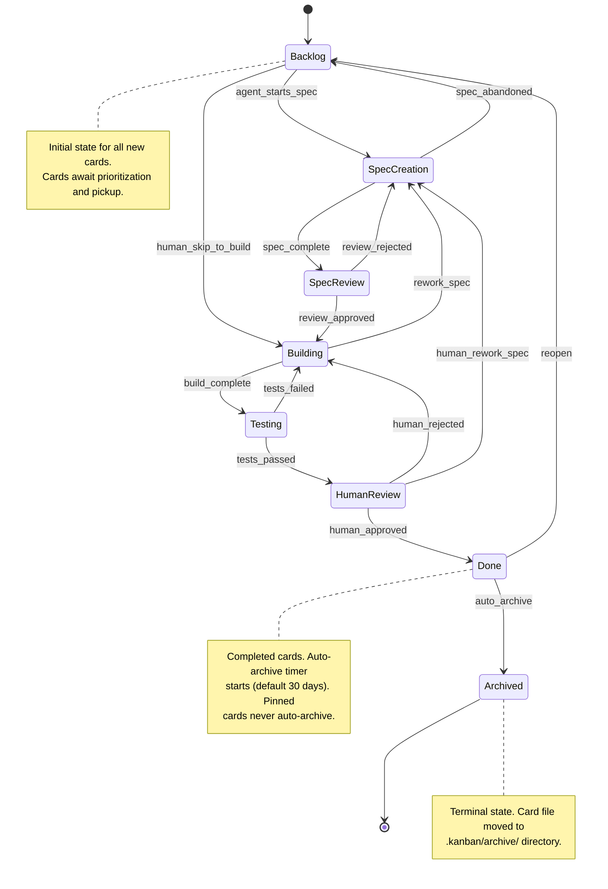
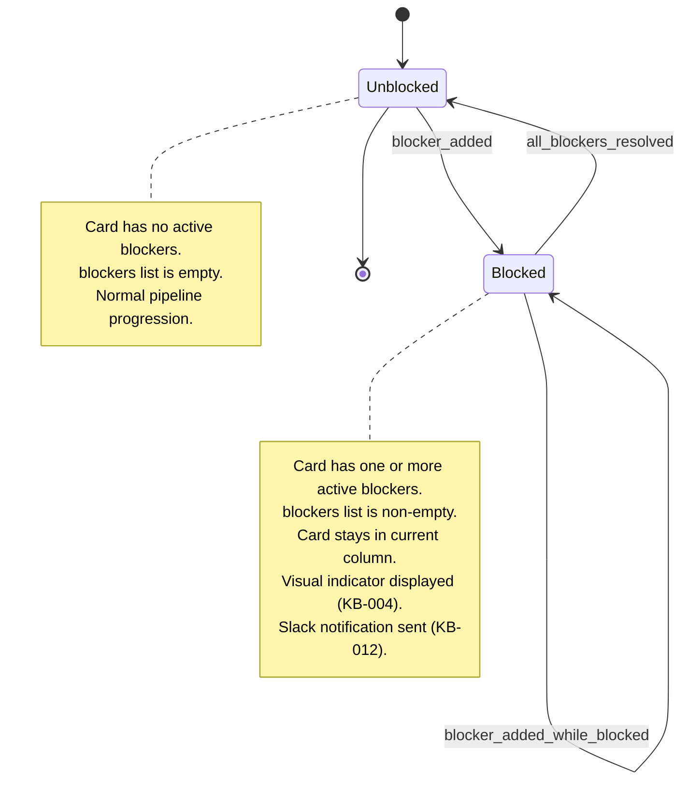
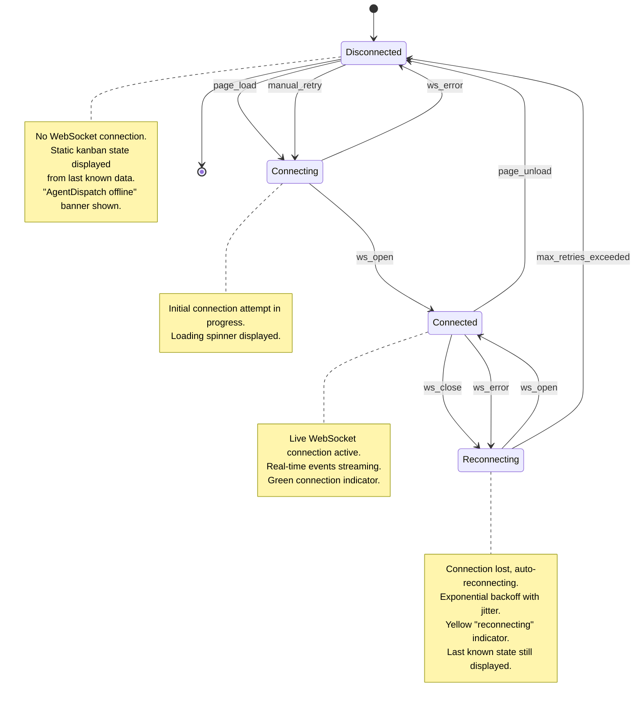

# Kanban Dashboard State Machines

> State machines governing card lifecycle, blocker state, and CMS connection state for the kanban dashboard system.

---

## Card Lifecycle

Governs the progression of a card through SDLC pipeline phases, from initial backlog entry through completion and eventual archival.

### State Diagram



### States

| State | Description | Entry Condition |
|-------|-------------|-----------------|
| Backlog | Card created and awaiting prioritization or agent pickup. No active SDLC work. | Card creation (UC-003, UC-007, UC-009) or reopening from Done |
| Spec Creation | Requirements analysis and schema design in progress by SPECOPS agents. | Agent picks up card and begins spec work |
| Spec Review | Specification complete, awaiting human review of requirements, schemas, and contracts. | SPECOPS requirements/schema agents complete their phases |
| Building | Implementation in progress. Code being written by builder agents or humans. | Human approves spec review, or human skips directly to build |
| Testing | Verification phase. Tests executing, spec-verify running acceptance criteria checks. | Builder agent signals build complete |
| Human Review | Implementation complete and tests passing. Awaiting final human sign-off. | All tests pass and verification succeeds |
| Done | Work item complete. Auto-archive timer begins counting down. | Human approves final review |
| Archived | Terminal state. Card file relocated to `.kanban/archive/`. | Auto-archive after `autoArchiveDays` in Done, or manual archive |

### Transition Rules

| From | To | Trigger | Guard | Side Effects | Mechanism |
|------|----|---------|-------|-------------|-----------|
| -- | Backlog | card_created | None | Card file created; ID added to board.yaml cardOrder; git commit (if agent) | File write (UC-003, UC-007, UC-009) |
| Backlog | Spec Creation | agent_starts_spec | Card has no active blockers | Card frontmatter `column` updated; `updated` timestamp set; agent note appended | File write by AgentDispatch |
| Backlog | Building | human_skip_to_build | Human initiates move (drag-drop or CLI) | Card frontmatter `column` updated; `updated` timestamp set | File write by VS Code extension or Claude Code skill |
| Spec Creation | Spec Review | spec_complete | Spec artifacts created (requirements.md, schemas.md exist) | Milestone note appended with file list; `updated` timestamp set; git commit | File write by SPECOPS agent |
| Spec Creation | Backlog | spec_abandoned | Agent or human decides to deprioritize | Note appended explaining abandonment; `updated` timestamp set | File write |
| Spec Review | Building | review_approved | Human approves the spec | Approval note appended; `updated` timestamp set | File write by human (VS Code or CLI) |
| Spec Review | Spec Creation | review_rejected | Human rejects with feedback | Rejection note appended with feedback; `updated` timestamp set | File write by human |
| Building | Testing | build_complete | Builder agent signals completion | Milestone note appended (files modified, branch name); `updated` timestamp set; git commit | File write by SPECOPS builder agent |
| Building | Spec Creation | rework_spec | Agent or human determines spec needs revision | Note appended explaining rework reason; `updated` timestamp set | File write |
| Testing | Human Review | tests_passed | All verification checks pass | Milestone note with test results appended; `updated` timestamp set; git commit | File write by SPECOPS verifier agent |
| Testing | Building | tests_failed | Verification checks fail | Failure note appended with details; `updated` timestamp set; agent may retry or block | File write by SPECOPS verifier agent |
| Human Review | Done | human_approved | Human approves final review | Approval note appended; `updated` timestamp set; auto-archive timer begins | File write by human |
| Human Review | Building | human_rejected | Human rejects with feedback | Rejection note appended with feedback; `updated` timestamp set | File write by human |
| Human Review | Spec Creation | human_rework_spec | Human determines spec-level rework needed | Note appended; `updated` timestamp set | File write by human |
| Done | Archived | auto_archive | `pin` is false AND days in Done >= `autoArchiveDays` | Card file moved from `cards/` to `archive/`; card ID removed from board.yaml cardOrder; git commit | Automatic on board load or heartbeat |
| Done | Backlog | reopen | Human or agent decides work is incomplete | Note appended explaining reopen reason; `updated` timestamp set; card ID moved in cardOrder | File write |

### Invalid Transitions

| Attempted | Error Code | Reason |
|-----------|-----------|--------|
| Archived -> any | CARD_ARCHIVED | Archived cards are in terminal state; must be manually restored to cards/ directory to re-enter the pipeline |
| Backlog -> Done | CARD_SKIP_PIPELINE | Cannot skip directly to Done; cards must pass through at least one active phase |
| Backlog -> Testing | CARD_SKIP_BUILD | Cannot test without building first |
| Backlog -> Human Review | CARD_SKIP_PIPELINE | Cannot request human review without preceding work |
| Spec Creation -> Done | CARD_SKIP_PIPELINE | Cannot complete without building and testing |
| Done -> Done | CARD_ALREADY_DONE | Card is already in Done state |
| Any -> Archived (manual) | CARD_MANUAL_ARCHIVE_BLOCKED | Use pin: false and wait for auto-archive, or move the file manually via filesystem |

### Notes

- Transitions are effected by writing to the card's frontmatter `column` field and updating the board.yaml `cardOrder` map. There is no API -- all transitions are file I/O operations.
- Any column-to-column move initiated by a human via drag-and-drop (UC-008) is permitted. The invalid transition table above represents logical constraints that tooling SHOULD warn about, but the file format does not enforce them. Agents MUST follow valid transitions.
- The `human_skip_to_build` transition exists because some cards (e.g., small bug fixes) do not need a formal spec phase.

---

## Card Blocker State

Governs the blocked/unblocked state of a card. This is orthogonal to the card lifecycle -- a card can be blocked in any non-terminal column.

### State Diagram



### States

| State | Description | Entry Condition |
|-------|-------------|-----------------|
| Unblocked | Card has zero active blockers. Normal pipeline progression is possible. | Initial card state, or last blocker resolved |
| Blocked | Card has one or more active blockers. Card stays in its current column until all blockers are resolved. Prominently displayed on board (KB-004). | Agent or human adds a blocker to the card's `blockers` frontmatter list |

### Transition Rules

| From | To | Trigger | Guard | Side Effects | Mechanism |
|------|----|---------|-------|-------------|-----------|
| Unblocked | Blocked | blocker_added | Blocker has valid `id`, `question`, `author`, `created` | Blocker appended to `blockers` list; blocker note appended to card body; `updated` timestamp set; Slack notification sent (KB-012); Vivian announces if meeting active | File write by agent; notification via AgentDispatch |
| Blocked | Blocked | blocker_added_while_blocked | New blocker has unique `id` within card | Additional blocker appended to `blockers` list; additional blocker note appended; `updated` timestamp set | File write by agent |
| Blocked | Unblocked | all_blockers_resolved | `blockers` list becomes empty after removal | Blocker(s) removed from frontmatter; resolution note appended to card body; `updated` timestamp set; AgentDispatch picks up unblocked card on next heartbeat | File write by human (UC-002) or agent |

### Invalid Transitions

| Attempted | Error Code | Reason |
|-----------|-----------|--------|
| Unblocked -> Unblocked (resolve) | CARD_NOT_BLOCKED | Cannot resolve a blocker on an unblocked card |
| Blocked -> Unblocked (partial) | CARD_STILL_BLOCKED | Removing one blocker when multiple exist does not transition to Unblocked; card remains Blocked until all are resolved |

### Blocker Resolution Flow

1. Human sees blocked card on board (pulsing visual indicator, KB-004)
2. Human opens card detail view (KB-005)
3. Card detail shows blocker `question` from agent and text area for response
4. Human writes answer in text area and clicks "Unblock" (KB-006)
5. Extension removes the resolved blocker from `blockers` frontmatter list
6. Extension appends a `**Blocker Resolved: {blocker-id}**` note to card body
7. Extension updates `updated` timestamp
8. If `blockers` list is now empty, card transitions to Unblocked
9. AgentDispatch detects unblocked card on next heartbeat and resumes work

### Notes

- Blocker state is derived from the `blockers` list in card frontmatter -- there is no separate state field
- A card can be blocked in any column (Backlog, Spec Creation, Building, etc.)
- Blocking does NOT change the card's column -- it stays in the column where work was in progress
- Multiple blockers can exist simultaneously; ALL must be resolved for the card to become unblocked
- The `blocked` label may be auto-applied/removed by tooling as a visual aid, but the authoritative blocked state is the `blockers` list

---

## CMS Connection State

Governs the WebSocket connection between the CMS ops dashboard (browser) and AgentDispatch for real-time event streaming (UC-006).

### State Diagram



### States

| State | Description | Entry Condition |
|-------|-------------|-----------------|
| Disconnected | No WebSocket connection to AgentDispatch. Dashboard shows static last-known state with "offline" banner. | Initial state before page load, after max retries exceeded, or after page unload |
| Connecting | Initial WebSocket connection attempt in progress. Loading indicator displayed. | CMS dashboard page loads or user clicks manual retry |
| Connected | Live WebSocket connection active. Real-time events (tool calls, card updates, agent status) streaming to dashboard. Green indicator shown. | WebSocket `onopen` fires successfully |
| Reconnecting | Connection was lost after being previously connected. Auto-reconnect in progress with exponential backoff. Yellow indicator and "reconnecting" message shown. Last known state still displayed. | WebSocket `onclose` or `onerror` fires while in Connected state |

### Transition Rules

| From | To | Trigger | Guard | Side Effects | Mechanism |
|------|----|---------|-------|-------------|-----------|
| Disconnected | Connecting | page_load | CMS page loaded and authenticated (KB-020) | Create WebSocket to `ws://{agentdispatch-host}/dashboard/ws`; show loading spinner | Browser WebSocket API |
| Disconnected | Connecting | manual_retry | User clicks "Retry Connection" button | Create new WebSocket connection; show loading spinner; reset retry counter | Browser WebSocket API |
| Connecting | Connected | ws_open | WebSocket `onopen` event fires | Show green connection indicator; begin processing incoming events; request initial state snapshot; establish SSE connections for active agents | WebSocket onopen handler |
| Connecting | Disconnected | ws_error | WebSocket `onerror` fires before `onopen` | Show "AgentDispatch offline" banner with retry button; display last known static state if available | WebSocket onerror handler |
| Connected | Reconnecting | ws_close | WebSocket `onclose` fires (unexpected) | Show yellow "reconnecting" indicator; start exponential backoff timer (initial: 1s, max: 10s, jitter: +/- 500ms); preserve last known state on screen | WebSocket onclose handler |
| Connected | Reconnecting | ws_error | WebSocket `onerror` fires while connected | Same as ws_close side effects | WebSocket onerror handler |
| Connected | Disconnected | page_unload | User navigates away or closes tab | Close WebSocket cleanly (code 1000); clean up SSE connections; no retry | Browser beforeunload handler |
| Reconnecting | Connected | ws_open | Reconnection attempt succeeds (`onopen` fires) | Reset retry counter and backoff delay; show green indicator; request state snapshot to catch up on missed events; re-establish SSE connections | WebSocket onopen handler |
| Reconnecting | Disconnected | max_retries_exceeded | Retry count exceeds max (default: 10) or backoff exceeds 10s for 3 consecutive attempts | Show "AgentDispatch offline" banner with manual retry button; stop auto-reconnect; preserve last known state | Backoff timer logic |

### Reconnection Parameters

| Parameter | Value | Description |
|-----------|-------|-------------|
| initialDelay | 1000ms | First reconnection attempt delay |
| maxDelay | 10000ms | Maximum backoff delay cap |
| backoffMultiplier | 2 | Exponential backoff multiplier |
| jitter | +/- 500ms | Random jitter to prevent thundering herd |
| maxRetries | 10 | Maximum consecutive reconnection attempts before giving up |

### Invalid Transitions

| Attempted | Error Code | Reason |
|-----------|-----------|--------|
| Disconnected -> Connected | CMS_NO_DIRECT_CONNECT | Cannot transition directly to Connected; must go through Connecting |
| Disconnected -> Reconnecting | CMS_NOT_PREVIOUSLY_CONNECTED | Reconnecting is only valid after a prior Connected state; use Connecting for initial connection |
| Connecting -> Reconnecting | CMS_NEVER_CONNECTED | Cannot reconnect if initial connection never succeeded; falls back to Disconnected |
| Reconnecting -> Connecting | CMS_USE_RECONNECT_FLOW | While reconnecting, continue the backoff flow; do not restart with a fresh Connecting state |

### Connection Lifecycle Sequence

```
1. Page loads -> Disconnected
2. After auth (KB-020) -> Connecting (WebSocket created)
3. If ws_open -> Connected (events streaming)
4. If connection drops -> Reconnecting (backoff starts)
5. On reconnect success -> Connected (state snapshot requested)
6. On max retries -> Disconnected (manual retry required)
```

### Notes

- The CMS dashboard is read-only (KB-019), so connection state only affects the display of real-time data, never data writes
- When in Reconnecting or Disconnected state, the dashboard still displays the last known kanban state -- it does not go blank
- SSE connections to individual agent thinking streams (`/agents/{id}/thinking`) follow the same reconnection pattern but are managed independently per agent panel
- The NFR-005 requirement specifies auto-reconnect within 10 seconds; the exponential backoff from 1s with multiplier 2 and max delay of 10s means attempts at 1s, 2s, 4s, 8s, 10s
- Basic auth (KB-020) is handled at the HTTP level before WebSocket upgrade; WebSocket itself does not carry auth tokens
