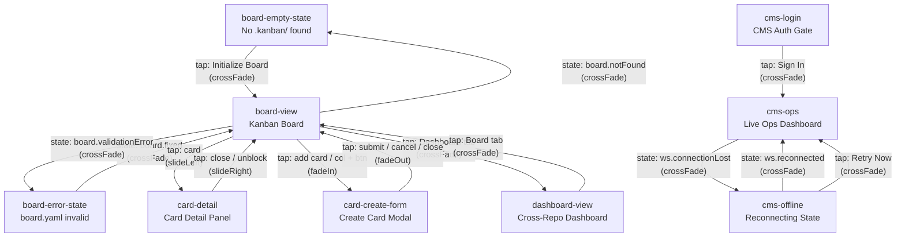

# Kanban Dashboard Wireframes

## Screen Inventory

| Screen Slug | Name | Dimensions | Use Cases | Description |
|-------------|------|------------|-----------|-------------|
| `board-view` | Board View | 1280x800 | UC-001, UC-002, UC-003, UC-004, UC-005, UC-006 | Primary VS Code webview panel: kanban board with 7 SDLC columns, card rendering, search/filter bar, undo toast, loading skeleton |
| `card-detail` | Card Detail | 1280x800 | UC-003, UC-004 | Split-layout card detail panel: metadata, blocker response form, adapter enrichment, notes timeline |
| `card-create-form` | Card Create Form | 1280x800 | UC-002 | Modal overlay for new card creation with inline validation, char counter, disabled submit guard |
| `dashboard-view` | Dashboard View | 1280x800 | UC-007 | Cross-repo project dashboard with health indicators, WIP progress bars, offline error states |
| `board-empty-state` | Board Empty State | 1280x800 | UC-001 | No `.kanban/` directory found: Initialize Board CTA + CLI hint |
| `board-error-state` | Board Error State | 1280x800 | UC-001 | `board.yaml` validation error: monospace error message + Open in Editor action |
| `cms-ops` | CMS Ops Dashboard | 1440x900 | UC-008, UC-009 | Browser dashboard: pipeline overview, active agents feed, blocked items column (read-only), completions column; WebSocket live updates |
| `cms-login` | CMS Login | 1440x900 | UC-008 | Basic auth gate for CMS dashboard; username/password form; `KANBAN_CMS_PASSWORD` env var hint |
| `cms-offline` | CMS Offline | 1440x900 | UC-008 | WebSocket disconnection state: reconnecting banner, stale-data notice, frozen content at 40% opacity |

---

## Navigation Map



**Initial screen (VS Code):** `board-view`
**Initial screen (CMS):** `cms-login`

---

## Component Summary

| Component | Used In | Key Variants | Notes |
|-----------|---------|--------------|-------|
| Top App Bar | board-view, card-detail, card-create-form, dashboard-view, board-empty-state, board-error-state | VS Code (1280px, tabs) | 56px height, `#0a0f0e` bg, 1px `#1a2e2a` bottom border |
| CMS Top Bar | cms-ops, cms-login, cms-offline | With connection badge | 56px height; connection badge: green Connected / amber Reconnecting / none on login |
| Kanban Column | board-view | Normal, WIP-exceeded, empty-column | Header with column name + card count + WIP indicator; KB-035 non-color: exclamation icon + red count when over limit |
| Kanban Card | board-view | Normal, Blocked, Enriched (specops), Enriched (ralph) | All cards show label dot + title + priority icon + Alt+Arrow keyboard hint (KB-034); blocked adds warning icon + BLOCKED badge + blocker age |
| Pipeline Bar | cms-ops, cms-offline | Live (clickable), Frozen (40% opacity) | 7 segments for SDLC columns; each segment shows count + label |
| Agent Panel | cms-ops | Running (spinner dot), Idle | Name + active card badge + tool call feed with timestamps; thinking state box |
| Blocked Item Row | cms-ops | Read-only (CMS) | Warning icon + question text + blocker age; resolve notice instead of action buttons (KB-019) |
| Completion Item | cms-ops | Success (check_circle + teal), Failure (cancel + red) | Card ID + title + column + timestamp |
| Card Detail Panel | card-detail | Normal metadata, With blocker section | 520px right panel; blocker section has disabled Unblock button (KB-032) until response typed |
| Loading Skeleton | board-view | Overlay | 7 skeleton columns + skeleton cards + centered spinner; visible in `loading` state (KB-028) |
| Undo Toast | board-view | 5s timer bar | Slides up from bottom; animated progress bar; dismiss button (KB-030) |
| Search/Filter Bar | board-view | Active filters (chips shown), Empty | Search input + Priority dropdown + Label dropdown + Blocked toggle + active filter chips (KB-033) |
| Create Card Modal | card-create-form | Title error state, Title valid state | Title required + char counter 0/200; Submit disabled until title entered (KB-031) |
| Connecting Overlay | cms-ops | CMS WebSocket connecting | Full-screen overlay on cms-ops; sync icon + text + WS URL (KB-029) |
| Offline Banner | cms-offline | Disconnected, Reconnecting | Amber banner; attempt count + next retry countdown; Manual Retry Now button (NFR-005) |
| Project Card | dashboard-view | Online, Offline, Partial | Health dot (green/amber/red) + repo name + WIP bar + blocked count |

---

## Data Flow

```
VS Code Extension (file system)
  │
  ├── FileSystem API (vscode.workspace.fs)
  │     readFile(.kanban/board.yaml)  ──→  Board schema ──→ board-view columns/cards
  │     readFile(.kanban/cards/*.yaml) ─→  Card schema  ──→ card-detail metadata
  │     watchFile(.kanban/**) ──────────→  Live reload on external changes
  │     writeFile (atomic write-then-rename, NFR-002) ──→ on card move / create / unblock
  │
  ├── Adapter Enrichment (AgentDispatch file I/O)
  │     RalphAdapter ──→  CardEnrichment.buildProgress  ──→ card progress bar
  │     SpecopsAdapter ─→  CardEnrichment.currentPhase   ──→ specops phase badge
  │     SpecArtifactAdapter → openQuestionsCount ──────→ open-questions badge
  │
  └── VS Code Views
        board-view ─── reads: Board, Card[], ColumnDefinition[]
        card-detail ── reads: Card (single), Blocker, Note[]
                       writes: Blocker.response, Card.status (unblock)
        card-create-form → writes: new Card to .kanban/cards/<id>.yaml
        dashboard-view ── reads: ProjectConfig[], per-repo DashboardSnapshot

CMS Browser Dashboard (WebSocket + SSE)
  │
  ├── WebSocket ws://host:3001/dashboard/ws
  │     DashboardSnapshot  (full state on connect)
  │     AgentToolCallEvent (streaming tool calls)
  │     CardMovedEvent     (real-time card transitions)
  │     BlockerCreatedEvent / BlockerResolvedEvent
  │     CompletionEvent    (agent task done)
  │
  ├── SSE /dashboard/sse (fallback)
  │
  ├── HTTP POST /api/auth (basic auth login)
  │
  └── CMS Views (read-only, KB-019)
        cms-login  ── POST /api/auth ──→ session cookie ──→ cms-ops
        cms-ops    ── WS DashboardSnapshot ──→ pipeline bar, agent panels, blocked/completions
        cms-offline ─ ws.connectionLost ──→ freeze last snapshot, show reconnecting UI
```

---

## Responsive Strategy

These wireframes target **desktop-only** fixed-size viewports. Both target environments are constrained rendering contexts that do not support free-form browser resizing:

| Environment | Fixed Canvas | Rationale |
|-------------|-------------|-----------|
| VS Code Webview | 1280x800 | VS Code controls panel dimensions; webview fills the editor tab |
| CMS Browser Dashboard | 1440x900 | Ops dashboard intended for desktop browser; minimum supported resolution |

**Screenshots** were captured across all 4 PSCanvas form factors (phone-portrait 393x852, phone-landscape 852x393, tablet-portrait 834x1194, tablet-landscape 1194x834) to satisfy the validation pipeline. However, the functional design targets only the desktop viewport dimensions above.

**Dark theme rendering note:** The PSCanvas screenshot renderer renders the Cyber-Industrial dark theme (`#080c0b` background, `#111816` surfaces) as nearly-invisible against the default PSCanvas light grid canvas. All 36 screenshots captured; the wireframe JSON files are structurally valid and complete. The visual output limitation is a renderer artifact and does not affect the wireframe specification.

---

## Accessibility Notes

### WCAG Compliance

**1.4.1 — Use of Color (Level A)**
All status distinctions use icon + color, never color alone:
- Blocked cards: `warning` icon + amber border + `BLOCKED` text badge (not just amber color)
- WIP limit exceeded: `warning` exclamation icon + red numeric count (not just red column header)
- Card priority: `warning`/`error`/`info` icon + priority label text in card detail (not just colored dots)
- Connection status badge: `cloud_off` icon + "Reconnecting..." text (not just amber color)
- Blocked item rows in CMS: `warning` icon alongside question text

**Keyboard Navigation (KB-034)**
- Every card in board-view displays the hint text `Alt+← →` for move-column keyboard shortcut
- All interactive elements have `role` and `label` in accessibility metadata
- Modal forms (card-create-form) trap focus; close via `Esc` key (form_close_btn handler)
- Tab order flows: top bar → filter bar → columns left-to-right → footer

**Screen Reader Landmarks**
- Top app bars: `role: banner`
- Column lists: `role: list` with column name as `aria-label`
- Individual cards: `role: listitem`; blocked cards additionally announce blocker age
- Buttons: all have descriptive `label` in accessibility metadata (not just icon names)
- Text inputs: `role: textbox` with explicit label associations
- Status badges: `role: status` with live region semantics for WS connection state

**Focus Management**
- Opening card-detail panel: focus moves to `detail_panel_header` (close button region)
- Opening card-create-form: focus moves to `title_input`
- Closing modals: focus returns to the triggering card or button on board-view
- Undo toast: announced via `aria-live: polite`; dismiss button is keyboard-reachable

**CMS-Specific**
- cms-offline offline banner: `role: alert` semantics; announced immediately on connection loss
- Frozen content area (`offline_frozen_content`): `aria-hidden: true` + `pointerEvents: none` (non-interactive)
- Connecting overlay: `role: status` with spinner text

---

## Validation Result

**pscanvas_validate** CLI was not available at the expected path (`/Users/sam/src/Kanban/../spec/validate-cli.ts`). Manual structural validation performed instead.

**Manual validation method:** `jq empty <file>` on all generated JSON files.

**Result: ALL PASS**

| File | Status | Node Count |
|------|--------|------------|
| `canvas.json` | PASS | — |
| `tokens.json` | PASS | 32 tokens (colors: 24, spacing: 6, radii: 4 variants) |
| `breakpoints.json` | PASS | — |
| `navigation.json` | PASS | 19 edges |
| `data-models.json` | PASS | 12 models |
| `spec-trace.json` | PASS | 37 node traces + 9 screen traces |
| `screens/board-view.json` | PASS | 153 nodes |
| `screens/board-view.behavior.json` | PASS | 8 states |
| `screens/card-detail.json` | PASS | 68 nodes |
| `screens/card-detail.behavior.json` | PASS | 7 states |
| `screens/card-create-form.json` | PASS | 40 nodes |
| `screens/card-create-form.behavior.json` | PASS | 8 states |
| `screens/dashboard-view.json` | PASS | 50 nodes |
| `screens/board-empty-state.json` | PASS | 11 nodes |
| `screens/board-error-state.json` | PASS | 12 nodes |
| `screens/cms-ops.json` | PASS | 107 nodes |
| `screens/cms-ops.behavior.json` | PASS | 4 states |
| `screens/cms-login.json` | PASS | 17 nodes |
| `screens/cms-login.behavior.json` | PASS | 5 states |
| `screens/cms-offline.json` | PASS | 26 nodes |

**Total nodes across all screens: 484**
**Total behavior states across all sidecars: 32**
**Screenshots captured: 36 (9 screens x 4 form factors)**
